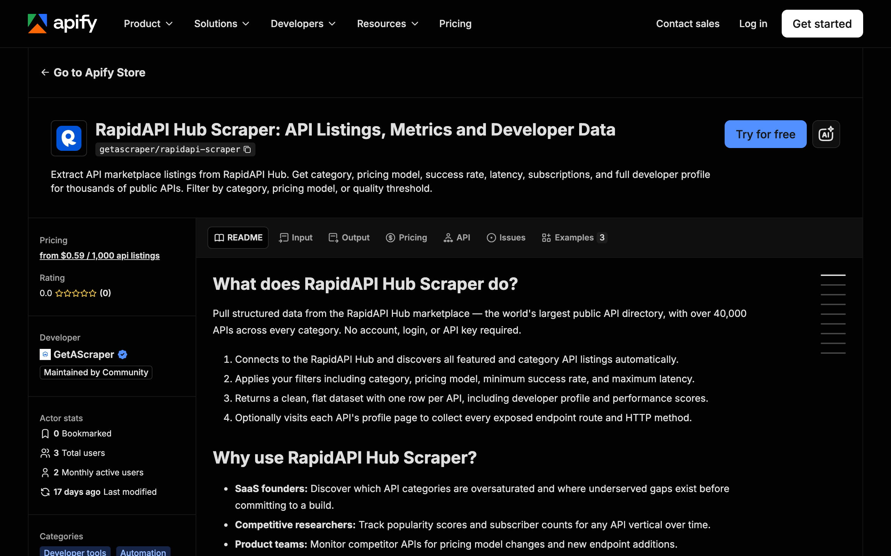

<div align="center">

# RapidAPI Hub Scraper: API Marketplace Listings

[](https://apify.com/getascraper/rapidapi-scraper)
[](https://apify.com/getascraper/rapidapi-scraper)
[](https://apify.com/getascraper/rapidapi-scraper)
[](https://github.com/getascraper/how-to-scrape-rapidapi/issues)
[](https://github.com/getascraper/how-to-scrape-rapidapi/commits/main)

Extract API marketplace listings from RapidAPI Hub. Get category, pricing model, success rate, latency, subscriptions, and full developer profile for thousands of public APIs. Filter by category, pricing model, or quality threshold.

[](https://apify.com/getascraper/rapidapi-scraper)

</div>

---

## Why use RapidAPI Hub Scraper

* **Spot undersaturated categories**: See which API categories are crowded and where gaps still exist before committing to a build.
* **Track competitor APIs over time**: Monitor popularity scores, subscriber counts, and pricing model changes for any vertical.
* **Vet reliability before you subscribe**: Filter listings by minimum success rate and maximum latency to shortlist only dependable APIs.
* **Map full developer and organization profiles**: Get developer identity plus parent organization details for every listing.
* **Build a structured API economy dataset**: Export clean, flat records ready for investment research or trend reporting.

---

## How to use RapidAPI Hub Scraper

1. Go to the RapidAPI Hub Scraper page on the Apify Store and click **Try for free**.
2. Leave Start URLs empty to scrape the global featured listing, or paste a specific RapidAPI category URL.
3. Click **Start**: The actor collects every matching record and writes one flat row per item.
4. **Download your results**: Export as Excel, CSV, JSON, or HTML from the Output tab.

---

## Input

| Field | Type | Required | Description |
| --- | --- | :---: | --- |
| `startUrls` | array of URLs | No | RapidAPI Hub category or collection URLs to crawl. Leave empty to scrape the global featured listing. |
| `searchQueries` | array of strings | No | Keywords to filter API listings by. Matched against API name, title, description, and category. |
| `categories` | array of strings | No | Only return APIs in these categories, e.g. Weather, Finance, Sports. Leave empty for all. |
| `pricingFilter` | enum | No | Filter by pricing model. Options: Any, Free only, Freemium only, Paid only. Defaults to Any. |
| `minPopularityScore` | number | No | Only return APIs with a RapidAPI popularity score at or above this value (0 to 10). Defaults to 0. |
| `minSuccessRate` | number | No | Only return APIs with an average success rate at or above this percentage (0 to 100). Defaults to 0. |
| `maxLatency` | integer | No | Only return APIs with average latency at or below this value in milliseconds. Set to 0 for no limit. |
| `collectionsFilter` | array of strings | No | Filter to specific RapidAPI collection slugs, e.g. weather-apis, sports-apis. Leave empty for all. |
| `deepScrape` | boolean | No | Visit each API profile to collect all exposed endpoint routes, HTTP methods, names, and descriptions. |
| `maxItems` | integer | No | Maximum total API listings to extract. Set to 0 for no limit. Defaults to 100. |
| `proxyConfiguration` | object | No | Proxy settings. The default configuration works for most requests. |

---

## Output

Each row in your dataset is one API listing, or one API endpoint when Deep Scrape is enabled. All fields are flat with no nested data, so the file opens cleanly in any spreadsheet program.

```json
{
  "api_id": "api_abc123",
  "name": "open-weather-map",
  "title": "Open Weather Map",
  "description": "Current and forecast weather data for any location worldwide.",
  "tags": "weather, forecast, climate",
  "version": "1.0",
  "category": "Weather",
  "base_url": "https://api.openweathermap.org",
  "playground_url": "https://rapidapi.com/community/api/open-weather-map",
  "developer": "community",
  "developer_name": "Community",
  "developer_type": "USER",
  "developer_id": 12345,
  "developer_username": "community",
  "developer_parent_id": "",
  "developer_parent_name": "",
  "developer_parent_username": "",
  "developer_parent_type": "",
  "developer_parent_thumbnail": "",
  "picture_url": "https://rapidapi.com/images/community.png",
  "popularity_score": 9.8,
  "latency_ms": 342,
  "service_level_percent": 100,
  "success_rate_percent": 99.2,
  "subscriptions_count": 1200000,
  "pricing_model": "FREEMIUM",
  "visibility": "PUBLIC",
  "created_at": "2018-03-15T10:00:00.000Z",
  "updated_at": "2024-11-01T09:00:00.000Z",
  "rapidapi_url": "https://rapidapi.com/community/api/open-weather-map",
  "endpoint_id": "",
  "endpoint_route": "",
  "endpoint_method": "",
  "endpoint_name": "",
  "endpoint_description": "",
  "endpoint_playground_url": "",
  "endpoint_params_count": 0,
  "endpoint_headers_count": 0,
  "scraped_at": "2026-06-23T17:00:00.000Z"
}
```

### Data table

| Field | Type | Description |
| --- | :---: | --- |
| `api_id` | string | Unique API identifier, prefixed with `api_`. |
| `name` | string | URL slug used in the RapidAPI marketplace. |
| `title` | string | Display name of the API. |
| `description` | string | Short description from the API listing. |
| `tags` | string | Comma-separated tags or keywords associated with the API. |
| `version` | string | Current published version string, if available. |
| `category` | string | Primary category on RapidAPI Hub. |
| `base_url` | string | Base URL for requests, if listed publicly. |
| `playground_url` | string | Direct link to the RapidAPI playground for this API. |
| `developer` | string | Developer username. |
| `developer_name` | string | Full display name of the developer. |
| `developer_type` | string | Account type of the developer. |
| `developer_id` | number | Numeric developer account ID. |
| `developer_username` | string | Developer username on RapidAPI. |
| `developer_parent_id` | string | Parent organization ID, if the developer belongs to an org. |
| `developer_parent_name` | string | Parent organization display name. |
| `developer_parent_username` | string | Parent organization username. |
| `developer_parent_type` | string | Parent organization account type. |
| `developer_parent_thumbnail` | string | URL to the parent organization thumbnail. |
| `picture_url` | string | URL to the API cover image or logo. |
| `popularity_score` | number | RapidAPI popularity score from 0 to 10. |
| `latency_ms` | number | Average response latency in milliseconds. |
| `service_level_percent` | number | Average service level percentage. |
| `success_rate_percent` | number | Average success rate percentage. |
| `subscriptions_count` | number | Number of active subscribers on RapidAPI. |
| `pricing_model` | string | Pricing model: FREE, FREEMIUM, or PAID. |
| `visibility` | string | Visibility setting: PUBLIC or PRIVATE. |
| `created_at` | string | ISO 8601 timestamp when the API was first listed. |
| `updated_at` | string | ISO 8601 timestamp of the most recent update. |
| `rapidapi_url` | string | Full marketplace listing URL. |
| `endpoint_id` | string | Endpoint identifier (deep scrape only). |
| `endpoint_route` | string | Endpoint route path, e.g. /v1/current (deep scrape only). |
| `endpoint_method` | string | HTTP method, e.g. GET, POST (deep scrape only). |
| `endpoint_name` | string | Display name of the endpoint (deep scrape only). |
| `endpoint_description` | string | Description of what the endpoint returns (deep scrape only). |
| `endpoint_playground_url` | string | Direct playground link for this endpoint (deep scrape only). |
| `endpoint_params_count` | number | Number of URL or query parameters (deep scrape only). |
| `endpoint_headers_count` | number | Number of required request headers (deep scrape only). |
| `scraped_at` | string | ISO 8601 timestamp of when this record was extracted. |

---

## Pricing

**$0.79 per 1,000 results. The first 50 results of every run are completely free.** No monthly subscriptions and no minimum commits.

You only pay for the API listings collected and saved to your dataset. A typical run of 100 listings completes in under a minute.

---

## Quick start

Create a `.env` file from `.env.example`, add your [Apify API token](https://console.apify.com/account/integrations), and run:

```bash
npm install
npm start
```

The script uses the [Apify API client](https://docs.apify.com/api/client/js/) to start the [RapidAPI Hub Scraper](https://apify.com/getascraper/rapidapi-scraper) actor and fetch results.

---

## Tips and optimization

* **Use category filters to narrow results**: Pass one or more names such as Finance or Sports to return only relevant listings.
* **Enable deep scrape for endpoint mapping**: Turn on Deep Scrape to collect every route and HTTP method exposed by each API. Useful for integration audits and API comparison tools.
* **Filter by success rate for reliable picks**: Set Min Success Rate to 95 or higher to surface only APIs with a strong reliability track record.
* **Stack filters for precision sourcing**: Combine category, pricing model, and latency filters to find free APIs under 500ms with high success rates in a single run.

---

## FAQ

**Is it legal to scrape RapidAPI Hub?**
Yes. This tool accesses only publicly visible marketplace listing pages and does not bypass any login, paywall, or access control.

**Does deep scrape cost more per run?**
Deep scrape visits each API profile page to collect endpoint data. This increases the number of result rows. You are charged per row returned, not per API visited.

**Can I scrape a specific category or collection?**
Yes. Paste a RapidAPI category URL into Start URLs, or use the Category Filter and Collections fields to target specific verticals without providing a URL.

---

## Support

For bug reports, missing fields, or feature requests, open an issue under the [Issues](https://github.com/getascraper/how-to-scrape-rapidapi/issues) tab, or visit the [RapidAPI Hub Scraper](https://apify.com/getascraper/rapidapi-scraper) page on Apify Store.
